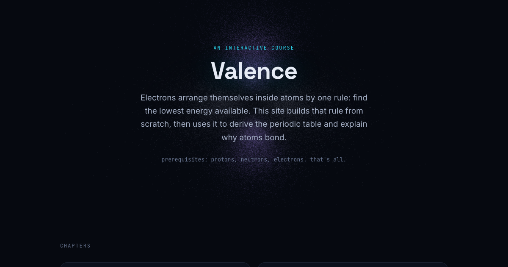

# Valence

Chemistry rebuilt from the bottom up: why electrons arrange the way they do, and why that one fact explains the rest.

**[Open the course →](https://maninae.github.io/valence/)**



---

Most chemistry classes hand you the periodic table, the filling order, and the bond types as rules to memorize. Valence builds them in front of you instead. Start with protons, neutrons, and electrons; end with Lewis structures of real molecules. Five short chapters, each one centered on something you can drag, rotate, or play with.

## Chapters

1. **Where electrons live** — the planetary atom collapses in ten picoseconds. What replaces it: standing waves, quantized energies, and rotatable 3D orbital clouds sampled from the real hydrogen wavefunctions.
2. **The filling order** — Pauli, Hund, and aufbau as a seating game, then the centerpiece: orbital energy levels that drift and cross as the nucleus grows, showing exactly why 4s fills before 3d.
3. **The table is a map** — the periodic table's odd shape *is* the filling order made visible. Build it row by row, then watch one number (the pull felt by outer electrons) drive every trend across it.
4. **One continuum, not three bonds** — covalent, polar, ionic: textbooks present three kinds of bond. There is one, with a dial. Drag the tug-of-war and morph a shared electron cloud into a full transfer.
5. **Building molecules** — Lewis structures as a working tool. An interactive builder with live octet checking, from H₂ to HCN.

## What makes it different

- **No memorization.** Every rule is derived from something you already saw. The filling order isn't given — you watch the energy levels rearrange and read it off.
- **Interactives are the spine, not decoration.** The 3D orbital viewer, the energy-curve crossing, the electronegativity tug-of-war, the Lewis builder — these *are* the explanation.
- **Honest about the model.** Orbital energies use Slater's rules (an empirical approximation, flagged where it shows). The orbital clouds are real hydrogenic wavefunctions, point-sampled.
- **Built for a smart STEM high schooler.** The only prerequisites are protons, neutrons, and electrons. No chemistry background assumed.

## How it's built

Static site. Vanilla JavaScript, no build step. [Three.js](https://threejs.org/) for the orbital clouds and the NaCl lattice, [KaTeX](https://katex.org/) for the math, both from CDN. Hosted on GitHub Pages straight from `main`. Element data baked to JSON from the [Periodic-Table-JSON](https://github.com/Bowserinator/Periodic-Table-JSON) dataset by `build/bake_data.py`.

## Run it locally

```
python3 -m http.server 8000   # then open http://localhost:8000
```

## License

[MIT](LICENSE).
